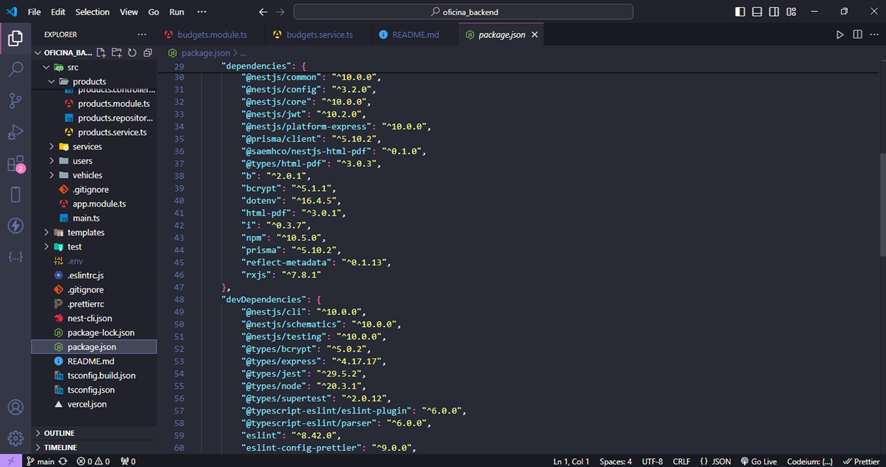

# Sobre o Projeto

- **Autor:** Danilo Nogueira Silva 24157 – Engenharia de Software
- **Frontend:** [Auto Mechanic](https://auto-mechanic-silva.vercel.app/)
  - **Login:** eder@gmail.com 
  - **Senha:** password
- **Backend:** [Oficina Backend](https://oficina-backend.vercel.app/)
- **Repositório do Backend:** [GitHub_backend](https://github.com/DaniloNogueira-Silva/oficina_backend)
- **Repositório do Frontend:** [Github_frontend](https://github.com/EderJrDev/auto-mechanic-silva)

O projeto foi uma colaboração entre Danilo Nogueira Silva e Éder Júnior. O frontend foi desenvolvido por Éder, enquanto Danilo trabalhou no backend. A aplicação web gerencia uma oficina, permitindo o cadastro de clientes, veículos, serviços e a geração de orçamentos.

# Comandos para Instalação

1. Defina a URL do banco no arquivo `.env` do projeto.
2. Instale as dependências:
```bash
npm install
cd src
npx prisma migrate dev
npm run start:dev
```

# Tecnologias Utilizadas

- **NestJS:** Framework do Node.js para desenvolvimento backend.
- **Prisma:** ORM para Node.js e TypeScript.

# Links Importantes

- **Frontend:** [Auto Mechanic](https://auto-mechanic-silva.vercel.app/)
- **Backend:** [Oficina Backend](https://oficina-backend.vercel.app/)
- **Repositório do Backend:** [GitHub](https://github.com/DaniloNogueira-Silva/oficina_backend)

## Imagens do Projeto




```
